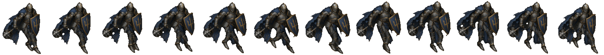

# BLUEPRINT — Bastion (STASIUM XII, PC)

> **How to read this file.** Every number below is quoted from a file on the box (path given) or from Mauro's direct rules
> for this pack (marked **[Mauro rule]**). Anything not found is written as **MISSING / not yet made**. Values marked
> **[measured for this pack]** were read off the delivered PNGs by the pack builder (read-only), not from a doc.
> Times are ET. Built Sat Oct 3 2026. Nothing in the art folders was modified.

## 1. Identity

| item | value | source |
|---|---|---|
| role | Guardian. Engine Aegis 0–4. Default element Earth. Role verb: Bastion **plants**. | art guide §5 |
| body read | Shield mass, planted, wide | art guide §5 |
| shape language | **Rectangle and shield disc, planted feet, almost no neck** | art guide §3 |
| what breaks the outline | the shield (guide); in the locked art, shield on the left arm and the mace hanging low image-left | guide §3; v18c METRICS |
| colour family | Bastion: **limestone, olive, old gold. Not hazard yellow.** | art guide §3 Color |
| palette hex | Only one value is in a file: painted gold trim, "median painted gold 153/131/101" = **#998365** (RGB → hex conversion by this pack). All other hex values: **MISSING / not yet made** (Bastion is not in `palettes.json`) | `bastion_march/proof_S_v18c/METRICS.md` (v18c changes) |
| Still socket | Guide rule: **one** socket, a small frozen-second relic; same logic on every class, different material; not an implant. **Bastion's socket material and placement: MISSING / not yet made.** | art guide §5 step 5 |
| banned for this class | plate catalog knight for Bastion | art guide §5 |
| kit (old mobile spec) | attack = Bash (Aegis Break reuses it); cast = Plant, Hold Line, Snap Wall; Intercept passive | `/workspace/art/ANIMATION_FRAMES_SPEC.md` §2.1 |

## 2. How it's drawn

- **Style [Mauro rule]:** painted 2D in the Dofus / Waven / Wakfu family. **Never 3D.** The art guide adds: broken-hour painted
  fantasy, painted not neon, metal dull or beaten (not chrome), three to five values per character (guide §1, §3).
- **View [Mauro rule]:** a 3/4-turned painting with the **whole body and face turned to the walk direction as one unit** —
  never the head alone. The facing check recorded for this class's painting is listed under "Source painting" below.
- **Edges [Mauro rule]:** no cyan outline, no white dots, no halos, **hard alpha** (each pixel fully opaque or fully transparent).

- **Source painting (locked walk):** `/home/box/agent-data/agents/10888a55-2177-4c78-97bf-f62165f60d9b/attachments/aec2638d134ab42fa6bf61f7e45978b66708e78f27386f4b629dcc46ab3d928e.jpg`
  (= `/workspace/art/bastion_march/proof_S_v18c/work/paint.jpg`, 1280×720; "byte-identical to v15 `paint.jpg`"). H = 644 painting px.
  **Facing check PASS** (v16): "helmet/visor, chest, hips/tabard and both boots face down-right (toes −9° / −4° off the 26.6° walk line)".
- **Mace master key (approved by Mauro):** `/home/box/agent-data/agents/10888a55-2177-4c78-97bf-f62165f60d9b/attachments/9c1b40a587293db742a8ec9b1f5aa7d44ab5bb1f4be4c1ac5b35dab5d9fac209.jpg`
  (thumbnail: `ref/bastion_mace_master_key_9c1b40a5_thumb_480.png`).
- Reference sheets: `/workspace/art/bastion_march/refs/bastion_turnaround_front_34_back.jpg`, `bastion_turnaround_FRONT_crop.png`,
  `bastion_turnaround_BACK_crop.png`, and walk keys `bastion_S_front_downright_walk_contact.jpg`,
  `bastion_W_front_downleft_walk_contact.jpg`, `bastion_N_back_upleft_walk_contact.jpg`,
  `bastion_E_back_upright_contact_APPROVED_3410f4e9.jpg`, `bastion_E_back_upright_passing_APPROVED_ed79c965.jpg` (all in `/workspace/art/bastion_march/refs/`).
- Edge audit (v18c METRICS): cyan 0, coloured outline px 0, white dots 0/0/0/0, seam slivers 0, 1 alpha component per frame.
  **Hard alpha: met** — 0 semi-transparent pixels in the 12 frames **[measured for this pack]** (v16c added "Hard alpha (≥128 →
  opaque, else transparent)"). Strict light px (over white): 24–45 per frame — **NOT MET** (transparent concave-corner px of the
  outer silhouette, inherited).
- Thumbnail in this pack: `ref/bastion_source_painting_thumb_480.png`.

## 3. Facings

Locked facing rule (Mauro; also written in `/workspace/art/pc_team_characters_handoff/README.md` and
`/workspace/art/hero_anims_painted/*/NOTES.md`):

| letter | view | walk direction on screen | how it is made |
|---|---|---|---|
| **S** | front view | down-right | painted + rigged (locked march) |
| **W** | front view | down-left | mirror of S **[Mauro rule]** |
| **N** | back view | up-left | needs its own back-view source |
| **E** | back view | up-right | needs its own back-view source |

**Letter warning for coders.** Older docs and the mobile exports use the OLD letters: `ANIMATION_FRAMES_SPEC.md` v0.2,
`HANDOFF_SPRITES.md`, `export_2x/characters/*/anims/`, `grok_project/anims/BATCH1*.md` and `pc/characters_world/*/meta.json`
put E = front down-right, S = front down-left, N = back up-right, W = back up-left. The README's remap is:
old e → **S**, old s → **W**, old n → **E**, old w → **N**. So a mobile `*_e.png` is a locked-rule **S** view.

| Bastion facing | exists? | path / note |
|---|---|---|
| **S** | **YES — locked, new** (12 frames) | `/workspace/art/bastion_march/proof_S_v18c/frames/bastion_march_S_f00.png … f11.png` (copy: `/workspace/art/march_all/locked_S_walks/bastion/`) |
| W | march version **MISSING / not yet made** (to be the mirror of S) | older preview: `/workspace/art/pc_team_characters_handoff/bastion_walk_w.png` (8 frames, 1152×176; from `bastion_review_4b/strips/`, round 4c) |
| N | march version **MISSING / not yet made** | older preview: `/workspace/art/pc_team_characters_handoff/bastion_walk_n.png` (8 frames; back walk rebuilt Oct 2 from painted leg keys) |
| E | march version **MISSING / not yet made** | older preview: `/workspace/art/pc_team_characters_handoff/bastion_walk_e.png` (8 frames) |

**Conflict to resolve before W is built:** the painted action set says "Bastion gets **true** W and N (no mirrors: a mirror would
put the shield on his right arm)" (`hero_anims_painted/bastion/KEY_REQUESTS.md`), and the mobile spec draws Bastion attack/cast
in all four facings. Mauro's rule for this pack says W = mirror of S. No file reconciles the two.

## 4. Weapon rules

- **[Mauro rule] Shield on his left arm; mace in his right hand, hanging low at the outer side like the master key; he keeps his
  forward lean.**
- Shield (v16 notes, carried to v18c): "rigid with the left forearm (one painted part), small ±8.5° swing about the shoulder".
- Mace (v16b/v16c/v18c METRICS): matched to master key 9c1b40a5 — fist at hip height on the image-left outer side, shaft down and
  outward; **mace axis 140.5…145.0° vs key 142.7°** (within ±8°, OK); per frame f00–f11: 141.3 143.8 144.9 145.0 143.2 140.5 (×2).
  Fist y − hip-joint y −0…+8 px; fist left of the far-thigh outer edge by ≥ 32 px. Mace head 67–83 % outside the cape silhouette,
  0 % on legs/body; mace vs boot/shin/visible thigh/between legs 0 px every frame. Fist travel vs pelvis x −10.0…+10.0 / y −4.6…+3.9
  px, "mace angle set by the bounce only". The painted mace was mirrored about the grip's vertical line (v16c).
- **All classes [Mauro rule]:** weapons ride the bounce with a **3–6° dip** and **never swing like a pendulum**. Bastion v18c mace dip = **4.5°** (lowest at f2/f8, OK).
- Forward lean kept: pelvis → helmet **7.7…9.8°, mean 9.0°** ("Bastion keeps his deeper lean (≈ v15 mean 8.75°)", OK).
- **Stale-doc warning:** `ANIMATION_FRAMES_SPEC.md` describes Bastion with "a short sword in his RIGHT hand" and a shield-bash
  attack. The current rule is a mace.

## 5. LOCKED walk blueprint

| item | value | source |
|---|---|---|
| locked version / folder | **v18c** — `/workspace/art/bastion_march/proof_S_v18c/` | `march_all/locked_S_walks/MANIFEST.md` |
| frames / timing | **12 frames × 58.33 ms = 0.70 s** | METRICS.md; `march_all/locked_S_walks/MANIFEST.md` |
| frame size | **132 × 151 px**, RGBA | `march_all/locked_S_walks/MANIFEST.md`; METRICS.md "cell 132×151" |
| game scale / H | 0.214; H = 644 painting px | METRICS.md |
| legs | painted thigh 160 / shin 107 × 0.935 ("Gloam v7b 'painted, then a touch shorter'") | METRICS.md |
| params | gait refit with Gloam v8b opt9 rules (`work/opt_b.py`, seed 2); root/upper body = Kestrel v6 code; `work/best.json` | METRICS.md |
| files | `frames/`, `bastion_march_S_strip_f0_f11.png`, `all_frames_f0_f11_4x.png`, `loop_4x_realtime.mp4`, `sbs_ref_vs_bastion_v18c.mp4`, `cmp3_v18_v18b_v18c_x2.mp4`, crops, `thigh_width.json`, `upper_body_diff.json`, `metrics.json` | folder listing |
| foot-contact anchor | **MISSING** ("not provided in metrics.json") | `march_all/locked_S_walks/MANIFEST.md` |

**Pipeline:** parts cut from the 3/4 painting aec2638d (v15 `cut.py`, tasset split into belt band / hip block / two scale-tasset
halves in v18) → rig (Kestrel v6 `rig.py`, pelvis root; swing hand-keyed in FK from v17b) → **full-res render (×4.67
supersample) → premultiplied area downscale** → cleanup: despeckle, light-fringe clamp, steel highlight cap, scraps removed,
seam-sliver clamp, plus Bastion-only waist-gap closer, edge desaturation of blue paint, backfill part under the arm, hard alpha.

**Class notes [Mauro rule]: Bastion v18c — heavy; shorter tasset skirt to mid-thigh; thick armoured thighs wider than the knee;
legs must be visible.** In the files: v18b "tasset hem y491 → 431 (about mid-thigh; near thigh midpoint y 425). Strip length below
the hip line: 146 → 86 px (−41 %)". v18c thick cuisses: top width near 72 px / far 66 px, taper to 82 % at the knee; on screen
near thigh 65.1–65.8 px (hem) vs knee plate 51.0–52.0 and greave max 53.1–54.6; far 60.2–61.3 vs 43.3–44.9 and 46.3–47.4.
"Thigh wider than the knee plate and at least the widest greave on every frame: OK."

**Key numbers (`proof_S_v18c/METRICS.md`):**

| metric | Bastion v18c | status in file |
|---|---|---|
| forward lean (pelvis → helmet) | 7.7…9.8°, mean 9.0 | OK |
| chest pivot vs pelvis top | 1.77 3.30 3.91 3.30 1.77 0.00 1.43 2.26 2.53 2.26 1.43 0.00 px | **NOT MET** (target 0 ± 1) |
| pelvis = root (torso vs pelvis) | max 3.912 px | **NOT MET** |
| spine bend toward weight side | ±2.6° at contact, peak ±3.0° | OK |
| shoulder counter-rotation | −7.0…+7.0° | OK |
| weight shift over stance foot | peak 74 % (f2/f8) | OK |
| pelvis lateral shift | peak 21.0 px of the 28.6 px foot offset | OK |
| hood/cape lag | 1-frame lag + sway, pins 0.000 px | OK |
| step heel-to-heel | 45.4 % H (292.2 px); heel strike → heel strike 45.37 / 45.37 % | OK |
| hip drop | 3.92 % H | OK |
| highest / lowest frames | [3, 9] / [5, 11] | **NOT MET** |
| figure height f0–f5 | 92.2 93.7 94.5 94.5 93.7 92.2 % (range 92.2–96.0) | **NOT MET** |
| knees near f00–f11 | 18 19 18 14 28 48 61 62 58 36 28 38° | — |
| weight knee f1–f3 / contact / max | 19 18 14° / 18° / 62° | OK |
| max knee change | 22.0°/frame | OK |
| ankle pitch near | +13 +4 +0 +0 −2 −12 +0 +0 +3 +8 +0 +6° | OK |
| swing thigh fwd f7–f10 / shin f8–f9 | +42 +50 +48 +49° / −8 +12° | OK |
| swing foot gap min / knee in front of line min | 10.9 px / 14.7 px | OK |
| hook / skim / both-soles-flat frames | none / none / none | OK |
| pelvis tilt / yaw / hip slide | ±4.0° / ±15.0° / ±8.2 px | OK |
| waist gap | 0 every frame | OK |
| forward velocity | 9.40–11.44 gpx/f, mean 10.42 | OK |
| foot lift / slide / travel | 7.7 % H / 0.000 gpx / 125 gpx per cycle | — |
| upper body above the belt vs v16c | 0 px differing on all 12 frames | — |

**Leg rules [Mauro rule]:** one weight leg and one swing leg. Weight knee soft, about 15°, with the hip dropped over it.
Swing knee lifts forward and the shin hangs. Heel lands first. The back foot pushes from the toe and leaves the ground — no
drag, no ballet point. Ankle: heel strike → flat → toe-off. Both soles flat only briefly at passing. Thigh and shin are two
shapes. The knee points with the foot; the feet point along the walk. No hook, no skim, flat whole-sole stance.

**Body rules [Mauro rule]:** the pelvis is the root. Chest, shoulders and hood ride the hip. The hip drops on the weight side.
The spine bends from the hip. The waist stays closed. The opposite shoulder counters ±7°. The body travels with the push.
Capes lag one frame.

Hook / skim test definitions (from `bastion_march/proof_S_v18c/METRICS.md`): *hook* = a swing frame with the shin behind −30°
from vertical, or the thigh not forward of vertical while the shin is behind; *skim* = swing toe clearance < 10 px (painting),
or both soles flat on more than one frame.

## 6. Attack, hit, death, cast, run

**Read first.** The only **locked** animation for any class is the S walk (section 5). Every action strip listed below was
built from the *older* painted walk keys (`mobile_walk_painted/`, round 3/4) or from mobile-era chibi art. None of them is
built from the locked march painting, and their cell sizes differ from the locked walk cell. Treat them as previews or stand-ins
unless their status line says "approved".

Painted Bastion action set (first pass, built on the round-3/4 painted walk rig; all four facings true painted, no mirrors):
`/workspace/art/hero_anims_painted/bastion/` — byte-identical copies in `/workspace/art/pc_team_characters_handoff/` and
`/workspace/art/bastion_review_4b/strips/` (md5 checked for `_s`). Status: **IN PROGRESS — legs are being revised** (handoff README).
Format: cells 144×176, pivot (72,152), one horizontal strip per file. Timing from `hero_anims_painted/bastion/NOTES.md` and
`tools/specs.py` (`FPS`, `HOLD`, `IMPACT`).

| state | real path(s) | frames | timing |
|---|---|---|---|
| **attack** (mace swing) | `/workspace/art/hero_anims_painted/bastion/bastion_attack_{s,w,e,n}.png` | 6 (864×176) | 12 fps; frame 3 held ×1.5; **impact on frame 4** |
| **hit** (feet locked) | `/workspace/art/hero_anims_painted/bastion/bastion_hit_{s,w,e,n}.png` | 4 (576×176) | 12 fps; contact frame 1 |
| **death** (collapse; last frame lying) | `/workspace/art/hero_anims_painted/bastion/bastion_death_{s,w,e,n}.png` | 6 (864×176) | 10 fps; hits the floor on frame 5; last frame held |
| **cast** | — | — | **MISSING / not yet made**: "No cast" (NOTES.md); handoff README "not painted / none in source". The old spec PROPOSED a 5-frame shield-plant cast (10 fps, impact frame 4, all 4 facings) |
| **run** | `/workspace/art/pc/characters_world/bastion/bastion_run_{e,s,n,w}.png` (old letters; cell 144×160) | 8 | 12 fps, cycle 0.6667 s; stride 90 px (e/w), 71.16 px (s/n). Built from mobile 0.1.61 static facings, not locked |

**Key poses** (comments in `hero_anims_painted/bastion/tools/specs.py`, front-view block; NOTES.md):
- Attack: 1 anticipation — sink, mace drawn back; 2 wind-up — fist up by the shoulder, head back behind him; 3 swing — mace
  comes over the top (held ×1.5); 4 **impact** — head forward-down at knee height, in front of the shield; 5 follow-through;
  6 recover. NOTES: in the back views (E, N) the attack reads as "a raised overhead arc and then a sideways blow".
- Hit: recoil back (pelvis up to 3.5 px back, lean −8°, shield arm +7…+10°), then settle over 4 frames; **sole profile shift 0 px** every hit frame.
- Death: 1 struck; 2 knees buckle, mace sags; 3 on his knees, mace head down; 4 topple forward from the knees; 5 hits the floor
  (floor squash sy 0.90); 6 lying (sy 0.88). NOTES weak spot 1: "Death 4–6 are rig stand-ins" for painted keys B4/B1.
- Weapons in every frame: shield on his LEFT arm, spiked mace in his RIGHT hand; "in S and W the mace is screen-left of the
  shield; in E and N it is screen-right … in all 64 frames" (NOTES QA).
- Requested painted keys B1–B5 (`KEY_REQUESTS.md`): B1 lying dead, B2 attack impact, B3 wind-up, B4 topple, B5 hit flinch (optional).
  `hero_anims_painted/bastion/keys_painted/` is **empty** → painted keys **MISSING / not yet made**.
- Also on disk without a describing doc: `/workspace/art/march_all/bastion_actions_strip.png` (3748×4568, Oct 3 06:33 ET) and
  `bastion_actions_preview.mp4` — origin/status **not documented**.

**Godot animation names:** spec pattern `<anim>_<e|s|n|w>` (old letters; Bastion `attack_*` and `cast_*` "all 4 drawn") —
`ANIMATION_FRAMES_SPEC.md` §8. No Bastion SpriteFrames `.tres` was found (the mobile ship log: "Mender and Bastion load from the
PNGs"). Old mobile chibi strips: `/workspace/scratch/repo/art/export_2x/characters/bastion/anims/bastion_{hit,walk}_{e,s,n,w}.png`
(hit 4 frames, 576×160). PC SpriteFrames: **MISSING / not yet made**.

Reference strips in this pack: `ref/bastion_attack_s_painted_preview.png`, `ref/bastion_hit_s_painted_preview.png`,
`ref/bastion_death_s_painted_preview.png`.

## 7. Do / Don't checklist

Critique tests from the art guide (`/home/box/agent-data/agents/10888a55-2177-4c78-97bf-f62165f60d9b/attachments/2a57dc564a5110a3486aff0c72d6b2d87ebcc395e5c0401b77f21c62de1cbfb5.md` §2 loop steps 4–7, §11), plus Mauro's rules for this pack.

**Run these three tests on every new frame or strip:**
1. **Three-value test** (guide §2.4, §3 Value): block it in light / mid / dark before colour. Three values minimum, five maximum
   for a character. If the dark shape is not the character, redo it. If it turns to noise when you squint, it failed.
   Specular dots are not a value plan.
2. **Silhouette test** (guide §2.5): fill the figure black. You must be able to name the class from the blob alone.
   Shape language for this class: rectangle and shield disc, planted feet, almost no neck.
3. **Board-scale test** (guide §2.6, §3 Scale): shrink it to its size on the 15×15 board (one body = one tile). If the class,
   tile or effect dies, it is not done. Props must not hide the tile under the feet.
4. Write a 5-line critique against guide §11 before calling it final.

**Do**
- Keep the shield on the left arm and the mace in the right fist low at the outer side (axis ≈ 142.7° like the master key); keep the deep forward lean and visible armoured legs.
- Keep the whole body and face turned to the walk direction as one unit.
- Keep the weapon riding the bounce with a 3–6° dip, no pendulum.
- Keep hard alpha, zero cyan, zero white dots or halos (re-run the audits listed in section 5).
- Keep one colour family for the class; accent stays small (guide §3 Color).
- Keep the Still as one small frozen-second relic, not tech (guide §5 step 5).

**Don't** (guide §11 fails + §5 banned cues)
- Don't make it readable only as a poster; it must survive token size.
- Don't let it read as a desaturated cyberpunk frame, or as generic medieval mud.
- Don't draw the Still as tech, and don't invent a class, nation, Still, WP or a party above 4.
- Don't give all five classes the same cloak, boots and belt pouch.
- Don't let an effect hide the unit; don't draw VFX into character frames (ANIMATION_FRAMES_SPEC §1.4).
- Banned cues: guns, magazines, optical sights, earpiece comms, cyber eyes, hologram visor, power armour, neon piping,
  katana-as-default for Gloam, plate catalog knight for Bastion, bikini armour, mud-brown everyone.
- Don't carry the mace across the chest (rejected v16 look) or let its head cover the legs; don't make him a plate catalog knight; don't lengthen the tasset skirt past mid-thigh.
- Don't turn the head alone; don't build or render in 3D.

## 8. Contact strip of the locked walk

`ref/bastion_locked_walk_S_contact_strip.png` — copied from `/workspace/art/march_all/locked_S_walks/bastion/bastion_contact_strip.png`
(1628×151, f00→f11).
