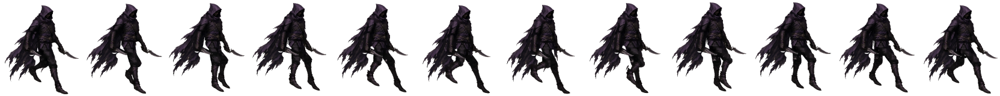

# BLUEPRINT — Gloam (STASIUM XII, PC)

> **How to read this file.** Every number below is quoted from a file on the box (path given) or from Mauro's direct rules
> for this pack (marked **[Mauro rule]**). Anything not found is written as **MISSING / not yet made**. Values marked
> **[measured for this pack]** were read off the delivered PNGs by the pack builder (read-only), not from a doc.
> Times are ET. Built Sat Oct 3 2026. Nothing in the art folders was modified.

## 1. Identity

| item | value | source |
|---|---|---|
| role | Assassin. Engine Umbral 0–4, Shades max 2. Default element Neutral. Role verb: Gloam **folds absence**. | art guide §5 |
| body read | Thin, hood, a Shade echo | art guide §5 |
| shape language | **Thin vertical, broken edge, hood, a second smaller echo (the Shade)**. The Shade is smaller and incomplete, not a second player character. | art guide §3, §5 Party read |
| what breaks the outline | "twin absence" (guide); in the locked art, the two daggers held low | guide §3 Silhouette; v8c frames |
| colour family | Gloam: **warm dusk, ink, dried flower. Not magenta cyber.** | art guide §3 Color |
| palette hex | **MISSING / not yet made** — `palettes.json` has entries for Kestrel and Ironjaw only; no palette was measured from the Gloam painting | `/workspace/art/tools/gender_color/palettes.json` |
| Still socket | Guide rule for all classes: **one** socket, a small frozen-second relic; same socket logic on every class, different material; not an implant. **Gloam's socket material and placement: MISSING / not yet made.** | art guide §5 step 5 |
| Shade echo art | **MISSING / not yet made** — no Shade figure is documented in the locked walk files | — |
| banned for this class | katana-as-default for Gloam | art guide §5 |
| kit (old mobile spec, for state mapping) | attack = Cut, Ambush; cast = Drop Shade, Fade; Nightfold gated | `/workspace/art/ANIMATION_FRAMES_SPEC.md` §2.1 |

## 2. How it's drawn

- **Style [Mauro rule]:** painted 2D in the Dofus / Waven / Wakfu family. **Never 3D.** The art guide adds: broken-hour painted
  fantasy, painted not neon, metal dull or beaten (not chrome), three to five values per character (guide §1, §3).
- **View [Mauro rule]:** a 3/4-turned painting with the **whole body and face turned to the walk direction as one unit** —
  never the head alone. The facing check recorded for this class's painting is listed under "Source painting" below.
- **Edges [Mauro rule]:** no cyan outline, no white dots, no halos, **hard alpha** (each pixel fully opaque or fully transparent).

- **Source painting (locked walk):** `/home/box/agent-data/agents/10888a55-2177-4c78-97bf-f62165f60d9b/attachments/db04e0566498a24462afd660936d99ece5fbc772e39ea05416e11e335a3e6b36.jpg` (= `/workspace/art/gloam_march/proof_S_v8c/work/paint.jpg`, 1280×720, sha256 db04e056…).
  Gloam v6 started from it as "new source painting db04e056 (whole body turned lower-right)" (`march_all/STATUS.md` 10:44).
  v8c METRICS facing row: hood/chest "always down-right, no mirror … OK" (head/torso rotation-only). H = 660 painting px.
- Reference sheets: `/workspace/art/march_refs/gloam_turnaround.jpg`, `/workspace/art/march_refs/gloam_S_stand.png`.
- Edge audit (v8c METRICS): cyan px 0 all frames; white-dot audit 0/0/0/0 all 12 f; seam light px 0; detached scraps 0.
  **Hard alpha: NOT MET** — the 12 delivered frames contain 38,778 semi-transparent pixels in total **[measured for this pack]**.
- Thumbnail in this pack: `ref/gloam_source_painting_thumb_480.png`.

## 3. Facings

Locked facing rule (Mauro; also written in `/workspace/art/pc_team_characters_handoff/README.md` and
`/workspace/art/hero_anims_painted/*/NOTES.md`):

| letter | view | walk direction on screen | how it is made |
|---|---|---|---|
| **S** | front view | down-right | painted + rigged (locked march) |
| **W** | front view | down-left | mirror of S **[Mauro rule]** |
| **N** | back view | up-left | needs its own back-view source |
| **E** | back view | up-right | needs its own back-view source |

**Letter warning for coders.** Older docs and the mobile exports use the OLD letters: `ANIMATION_FRAMES_SPEC.md` v0.2,
`HANDOFF_SPRITES.md`, `export_2x/characters/*/anims/`, `grok_project/anims/BATCH1*.md` and `pc/characters_world/*/meta.json`
put E = front down-right, S = front down-left, N = back up-right, W = back up-left. The README's remap is:
old e → **S**, old s → **W**, old n → **E**, old w → **N**. So a mobile `*_e.png` is a locked-rule **S** view.

| Gloam facing | exists? | path / note |
|---|---|---|
| **S** | **YES — locked, new** (12 frames) | `/workspace/art/gloam_march/proof_S_v8c/frames/gloam_march_S_f00.png … f11.png` (copy: `/workspace/art/march_all/locked_S_walks/gloam/`) |
| W | march version **MISSING / not yet made** (to be the mirror of S) | older preview: `/workspace/art/pc_team_characters_handoff/gloam_walk_w.png` (8 frames, 1152×176, round-4 painted walk, not locked) |
| N | march version **MISSING / not yet made** | older preview: `/workspace/art/pc_team_characters_handoff/gloam_walk_n.png` (not locked) |
| E | march version **MISSING / not yet made** | older preview: `/workspace/art/pc_team_characters_handoff/gloam_walk_e.png` (not locked) |

## 4. Weapon rules

- **[Mauro rule] Daggers low, blades forward.** v8c: each hand keeps its own painted dagger (v6 build note, `march_all/STATUS.md`
  11:05). Dagger axis vs walk line −2.27…+2.23° (target ±8°, OK); per frame f00–f11: +1.8 −1.0 −2.2 −2.3 −0.5 +2.2 (×2).
  Fist slide along the walk: near −3.4…3.0 % H, far −3.4…1.8 % H; "blade angle held, not swung". Foot/shin–dagger overlap 0 px
  every frame (`proof_S_v8c/METRICS.md`).
- **All classes [Mauro rule]:** weapons ride the bounce with a **3–6° dip** and **never swing like a pendulum**. Gloam v8c dip = **4.5°**, lowest at f2/f8 (METRICS "dagger dip with the bounce", OK).

## 5. LOCKED walk blueprint

| item | value | source |
|---|---|---|
| locked version / folder | **v8c** — `/workspace/art/gloam_march/proof_S_v8c/` (v8b motion + cleanup only) | `march_all/locked_S_walks/MANIFEST.md`; METRICS.md title |
| frames / timing | **12 frames × 58.33 ms = 0.70 s** | METRICS.md; `march_all/locked_S_walks/MANIFEST.md` |
| frame size | **135 × 160 px**, RGBA | `march_all/locked_S_walks/MANIFEST.md`; METRICS.md "cell 135×160" |
| game scale / H | 0.214; H = 660 painting px | METRICS.md |
| params | `work/best.json` (torso, arms, cape, hood, daggers, timing, travel, stride and hip curve frozen from v6 in `work/opt9.py`) | METRICS.md |
| files | `frames/`, `all_frames_f0_f11_4x.png`, `loop_4x_realtime.mp4`, `sbs_ref_vs_gloam_v8c.mp4`, crops, `seam_audit.json`, `metrics.json` | folder listing |
| foot-contact anchor | **MISSING** ("not provided in metrics.json") | `march_all/locked_S_walks/MANIFEST.md` |

**Pipeline:** Gloam v5+ were rebuilt on the Ironjaw v7 code (STATUS 10:13, 10:44). Parts cut from db04e056 with the Ironjaw v5
`cut.py` method — each painted boot on its own leg, un-pitched and sheared onto the walk line; each hand keeps its own painted
dagger (STATUS 10:54) → rig with pelvis as single root (v8/v8b) → full-res render → premultiplied area downscale (the shared
code; Kestrel v6 METRICS: "Full-res render (×4.67 supersample) then premultiplied area downscale") → **v8c cleanup**: dark
under-fill behind seams, seam light-edge recolour alternated with despeckle until 0, detached components < 700 full-res px dropped.

**Class notes [Mauro rule]: Gloam v8b/v8c legs 6.5 % shorter, pelvis yaw ±15°.** In the files: v7b "Legs 151.7 → 141.8
px/segment (6.5 % shorter, painted ~151), body lowered" (STATUS 11:37); v8c pelvis yaw −15.0…+15.0° (METRICS).

**Key numbers (`proof_S_v8c/METRICS.md`):**

| metric | Gloam v8c | status in file |
|---|---|---|
| step heel-to-heel | 45.8 % H (302.3 px; v8 was 46.6 %) | OK vs 40–48 %; **NOT MET** vs v8 (−1.8 %) |
| ankle-to-ankle at contact f0 / f6 | 37.5 / 37.0 % | OK |
| contacts | f0 near (m), f6 far (s) | OK |
| hip drop | 3.62 % H | OK |
| highest / lowest frames | [3, 9] / [5, 11] | **NOT MET** |
| figure height f0–f5 (×2) | 94.6 96.0 96.8 96.8 96.0 94.6 % (range 94.6–98.2) | **NOT MET** (<97 %) |
| knees near f00–f11 | 13 14 17 16 23 34 54 75 69 51 34 32° | — |
| weight knee (stance f1–f3) | 14 17 16° | OK (≈15°) |
| contact knee / max | 13° / 75° | OK |
| max knee change | 20.6° per frame | OK |
| ankle pitch near f00–f11 | +13 +4 +0 +0 −1 −6 −10 −10 −8 −4 +1 +6° | OK (heel strike → flat → heel lift → toe-off) |
| swing thigh fwd f7–f10 / shin f8–f9 | +39 +54 +57 +53° / −14 +6° | OK |
| swing foot gap | min 12.5 px | OK |
| knee in front of hip-ankle line | min 16.0 px | OK |
| toe axis vs walk line | −13.2…+8.3° (beyond ±8° only on pitch frames) | OK |
| foot lift / slide | 8.4 % H / 0.000 gpx | OK |
| pelvis root (torso vs pelvis) | 0.000 px | OK |
| hip-joint slide vs pelvis | ±1.5 px | OK |
| pelvis tilt (weight side down) | −4.0…+4.0° | OK |
| pelvis lateral shift to stance foot | peak 7.0 px of 17.5 px (≈ 40 %) | partial |
| shoulder counter-rotation | −7.0…+7.0° | OK |
| chest tilt (spine counter-bend 60 %) | 0.4…3.6° | OK |
| lean | 0.4–3.6° | OK |
| waist gap | 0 every frame | OK |
| forward velocity (push surge) | 9.76–11.80 gpx/f, mean 10.78 | OK |
| travel per cycle | 129 gpx | — |
| cape 1-frame lag | **not measured in v8c** (cape has −1…+4° sway; the 1-frame lag row first appears in Kestrel v6) — MISSING | — |

**Leg rules [Mauro rule]:** one weight leg and one swing leg. Weight knee soft, about 15°, with the hip dropped over it.
Swing knee lifts forward and the shin hangs. Heel lands first. The back foot pushes from the toe and leaves the ground — no
drag, no ballet point. Ankle: heel strike → flat → toe-off. Both soles flat only briefly at passing. Thigh and shin are two
shapes. The knee points with the foot; the feet point along the walk. No hook, no skim, flat whole-sole stance.

**Body rules [Mauro rule]:** the pelvis is the root. Chest, shoulders and hood ride the hip. The hip drops on the weight side.
The spine bends from the hip. The waist stays closed. The opposite shoulder counters ±7°. The body travels with the push.
Capes lag one frame.

Hook / skim test definitions (from `bastion_march/proof_S_v18c/METRICS.md`): *hook* = a swing frame with the shin behind −30°
from vertical, or the thigh not forward of vertical while the shin is behind; *skim* = swing toe clearance < 10 px (painting),
or both soles flat on more than one frame.

## 6. Attack, hit, death, cast, run

**Read first.** The only **locked** animation for any class is the S walk (section 5). Every action strip listed below was
built from the *older* painted walk keys (`mobile_walk_painted/`, round 3/4) or from mobile-era chibi art. None of them is
built from the locked march painting, and their cell sizes differ from the locked walk cell. Treat them as previews or stand-ins
unless their status line says "approved".

**Painted (march-style or round-4 painted) Gloam attack / hit / death / cast: MISSING / not yet made.** The PC handoff README says
"Gloam attack/hit/death/cast — Not painted yet".

Older mobile-era strips that DO exist (limb puppet from the old chibi masters, Batch-1c, Sep 25; old letters; cell 144×160,
pivot (72,152)); from `/workspace/art/grok_project/anims/BATCH1C_SHIPPED.md`:

| state | real path(s) | frames | timing | Godot name (mobile `gloam_frames.tres`) |
|---|---|---|---|---|
| attack (twin-dagger X-slash) | `/workspace/art/export_2x/characters/gloam/anims/gloam_attack_{e,s,n,w}.png` (720×160); masters `/workspace/art/grok_project/anims/gloam_attack_{se,sw,ne,nw}.png` | 5 | 12 fps, no loop, impact index **2** (0-based) | `attack_e/_s/_n/_w` |
| cast (hand flick: Drop Shade, Fade) | `…/gloam/anims/gloam_cast_{e,s,n,w}.png` (576×160) | 4 | 10 fps, impact index 2 | `cast_*` |
| hit | `…/gloam/anims/gloam_hit_{e,s,n,w}.png` (576×160) | 4 | 12 fps, impact index 0 | `hit_*` |
| death | `…/gloam/anims/gloam_death_{e,s,n,w}.png` (864×160) | 6 | 10 fps, hold last, impact index 4 | `death_*` |
| walk (old) | `…/gloam/anims/gloam_walk_{e,s,n,w}.png` | 6 | 12 fps loop | `walk_*` |
| **run** | `/workspace/art/pc/characters_world/gloam/gloam_run_{e,s,n,w}.png` (old letters; cell 144×160) | 8 | 16 fps, cycle 0.5 s; stride 118 px (e/w), 93.3 px (s/n) | — (PC world strips; built from mobile 0.1.61 static facings) |

Godot resource for the mobile set: `/workspace/sx_main/art/export_2x/characters/gloam/gloam_frames.tres` (attack 5 f @12,
cast 4 f @10, death 6 f @10, hit 4 f @12, walk 6 f @12 loop). PC SpriteFrames: **MISSING / not yet made**.

**Key poses** — only the old spec pose lists exist (`ANIMATION_FRAMES_SPEC.md` §2.4, PROPOSED):
- attack (X-slash, slash on 3): 1 coil, low crouch, daggers crossed in front of the chest; 2 lunge, arms pulling out wide;
  3 slash — both daggers sweep across in an X, body stretched forward; 4 follow-through, weight on the front foot; 5 recover to
  a low guard.
- cast (hand flick, release on 3): 1 ready, low guard; 2 left hand dips low, dagger reversed, body crouches; 3 release — left
  hand flicks outward low toward the facing; 4 recover.
- hit (3 in spec; the shipped mobile strip has 4): flinch, biggest recoil, recovering. death (6, ground on 5): struck, knees
  buckle, both knees, topple, hits ground, lying still — compact heap inside the cell.

## 7. Do / Don't checklist

Critique tests from the art guide (`/home/box/agent-data/agents/10888a55-2177-4c78-97bf-f62165f60d9b/attachments/2a57dc564a5110a3486aff0c72d6b2d87ebcc395e5c0401b77f21c62de1cbfb5.md` §2 loop steps 4–7, §11), plus Mauro's rules for this pack.

**Run these three tests on every new frame or strip:**
1. **Three-value test** (guide §2.4, §3 Value): block it in light / mid / dark before colour. Three values minimum, five maximum
   for a character. If the dark shape is not the character, redo it. If it turns to noise when you squint, it failed.
   Specular dots are not a value plan.
2. **Silhouette test** (guide §2.5): fill the figure black. You must be able to name the class from the blob alone.
   Shape language for this class: thin vertical, broken edge, hood, a second smaller echo (the Shade).
3. **Board-scale test** (guide §2.6, §3 Scale): shrink it to its size on the 15×15 board (one body = one tile). If the class,
   tile or effect dies, it is not done. Props must not hide the tile under the feet.
4. Write a 5-line critique against guide §11 before calling it final.

**Do**
- Keep both daggers low with the blades forward, angle held (no swing), and keep the hood shape.
- Keep the whole body and face turned to the walk direction as one unit.
- Keep the weapon riding the bounce with a 3–6° dip, no pendulum.
- Keep hard alpha, zero cyan, zero white dots or halos (re-run the audits listed in section 5).
- Keep one colour family for the class; accent stays small (guide §3 Color).
- Keep the Still as one small frozen-second relic, not tech (guide §5 step 5).

**Don't** (guide §11 fails + §5 banned cues)
- Don't make it readable only as a poster; it must survive token size.
- Don't let it read as a desaturated cyberpunk frame, or as generic medieval mud.
- Don't draw the Still as tech, and don't invent a class, nation, Still, WP or a party above 4.
- Don't give all five classes the same cloak, boots and belt pouch.
- Don't let an effect hide the unit; don't draw VFX into character frames (ANIMATION_FRAMES_SPEC §1.4).
- Banned cues: guns, magazines, optical sights, earpiece comms, cyber eyes, hologram visor, power armour, neon piping,
  katana-as-default for Gloam, plate catalog knight for Bastion, bikini armour, mud-brown everyone.
- Don't give Gloam a katana; don't let the Shade read as a second player character (guide §5).
- Don't turn the head alone; don't build or render in 3D.

## 8. Contact strip of the locked walk

`ref/gloam_locked_walk_S_contact_strip.png` — copied from `/workspace/art/march_all/locked_S_walks/gloam/gloam_contact_strip.png`
(1664×160, f00→f11).
