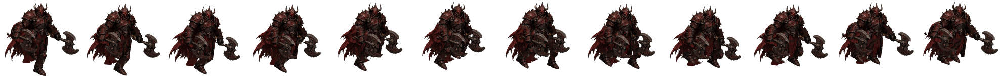

# BLUEPRINT — Ironjaw (STASIUM XII, PC)

> **How to read this file.** Every number below is quoted from a file on the box (path given) or from Mauro's direct rules
> for this pack (marked **[Mauro rule]**). Anything not found is written as **MISSING / not yet made**. Values marked
> **[measured for this pack]** were read off the delivered PNGs by the pack builder (read-only), not from a doc.
> Times are ET. Built Sat Oct 3 2026. Nothing in the art folders was modified.

## 1. Identity

| item | value | source |
|---|---|---|
| role | Warrior. Engine Impact 0–4. Default element Earth. Role verb: Ironjaw **impacts**. | art guide §5 |
| body read | Heavy, low, jaw and shoulder | art guide §5 |
| shape language | **Heavy wedge, low centre, jaw and shoulder mass** | art guide §3 |
| what breaks the outline | jaw-weight (the guide's word); in the locked art, the two axes | guide §3 Silhouette; v7 frames |
| colour family | Earth / Ironjaw: **ochre, baked clay, iron black. Not plastic bronze.** | art guide §3 Color |
| palette hex (mobile-era file) | `palettes.json` "locked" Ironjaw palette: primary_armor **#563226** (lo #3e241a, hi #804e40, "rusty red plate"); secondary **#41342b** (lo #33271d, hi #574d45, "under/joints dark"); accent_metal **#817e7a** (lo #41413f, hi #d8d3cd, "wear highlights"); helmet_bone **#c8c2b8**; weapon_stone **#7a7a78**; skin **#c4a882** | `/workspace/art/tools/gender_color/palettes.json` (same file in `export_2x/characters_custom/`). It was written for the mobile/chibi art (`characters_custom` path contract) |
| palette hex of the locked march painting | **MISSING / not yet made** (no palette file measured from the march painting) | — |
| Still socket | Guide rule for all classes: **one** socket, a small frozen-second relic (glass sliver, stopped drip, trapped feather, shard of paused flame); same socket logic on every class, different material; not an implant, not tech. **Ironjaw's socket material and placement: MISSING / not yet made** (no file assigns it). | art guide §5 step 5, §1.4 |
| kit (from the old mobile spec, for state mapping only) | attack = Strike; Shoulder and Crush reuse `attack`; Advance = tween + VFX only; no cast | `/workspace/art/ANIMATION_FRAMES_SPEC.md` §2.1 |

## 2. How it's drawn

- **Style [Mauro rule]:** painted 2D in the Dofus / Waven / Wakfu family. **Never 3D.** The art guide adds: broken-hour painted
  fantasy, painted not neon, metal dull or beaten (not chrome), three to five values per character (guide §1, §3).
- **View [Mauro rule]:** a 3/4-turned painting with the **whole body and face turned to the walk direction as one unit** —
  never the head alone. The facing check recorded for this class's painting is listed under "Source painting" below.
- **Edges [Mauro rule]:** no cyan outline, no white dots, no halos, **hard alpha** (each pixel fully opaque or fully transparent).

- **Source painting (locked walk):** `/workspace/art/ironjaw_march/proof_S_v5/work/paint.jpg` (1280×720, sha256 1c719697…). The v7 build
  "restarted from the cut-off v7 job's saved work and its v6 base. Nothing was repainted" and v6 was "built from v5's parts and
  code" (`proof_S_v7/REPORT.md`, `proof_S_v6/REPORT.md`). H = 650 painting px (horn tip to sole).
  Facing: v7 REPORT "Kept from v6" lists "Head and body facing the same way"; boots face the walk line (heading 0.0° all
  frames). A separate whole-body facing-check file for this painting: **not found**.
- Reference sheets: `/workspace/art/march_refs/ironjaw_turnaround.jpg`, `/workspace/art/march_refs/ironjaw_S_stand.png`.
- Edge audit on the locked frames: white-dot audit 0/0/0/0 on all 12 frames (isolated light / near-white / light fringe /
  alpha<40), METRICS.md. Cyan count: **not recorded** in Ironjaw v7 METRICS.md. **Hard alpha: NOT MET** — the 12 delivered
  frames contain 19,786 semi-transparent pixels in total **[measured for this pack]**.
- Thumbnail of the painting in this pack: `ref/ironjaw_source_painting_thumb_480.png`.

## 3. Facings

Locked facing rule (Mauro; also written in `/workspace/art/pc_team_characters_handoff/README.md` and
`/workspace/art/hero_anims_painted/*/NOTES.md`):

| letter | view | walk direction on screen | how it is made |
|---|---|---|---|
| **S** | front view | down-right | painted + rigged (locked march) |
| **W** | front view | down-left | mirror of S **[Mauro rule]** |
| **N** | back view | up-left | needs its own back-view source |
| **E** | back view | up-right | needs its own back-view source |

**Letter warning for coders.** Older docs and the mobile exports use the OLD letters: `ANIMATION_FRAMES_SPEC.md` v0.2,
`HANDOFF_SPRITES.md`, `export_2x/characters/*/anims/`, `grok_project/anims/BATCH1*.md` and `pc/characters_world/*/meta.json`
put E = front down-right, S = front down-left, N = back up-right, W = back up-left. The README's remap is:
old e → **S**, old s → **W**, old n → **E**, old w → **N**. So a mobile `*_e.png` is a locked-rule **S** view.

| Ironjaw facing | exists? | path / note |
|---|---|---|
| **S** | **YES — locked, new** (12 frames) | `/workspace/art/ironjaw_march/proof_S_v7/frames/ironjaw_march_S_f00.png … f11.png` (copy: `/workspace/art/march_all/locked_S_walks/ironjaw/`) |
| W | march version **MISSING / not yet made** (to be the mirror of S) | older preview: `/workspace/art/pc_team_characters_handoff/ironjaw_walk_w.png` (8 frames, 1152×176, round-4 painted walk, not locked) |
| N | march version **MISSING / not yet made** | older preview: `/workspace/art/pc_team_characters_handoff/ironjaw_walk_n.png` (8 frames, not locked) |
| E | march version **MISSING / not yet made** | older preview: `/workspace/art/pc_team_characters_handoff/ironjaw_walk_e.png` (8 frames, not locked) |

## 4. Weapon rules

- **[Mauro rule] Two axes whose design never changes.** In the locked v7: "Axes −2.6…+2.4° vs the walk line, with a 5° dip at
  the lowest frames. Axe design unchanged" (`proof_S_v7/REPORT.md`); METRICS.md row "axe vs walk line / dip: [-2.57, 2.43] / 5°,
  OK, design unchanged". Axe angle per frame f00–f11: 24.0 26.64 29.0 27.45 25.09 24.08 (×2) (`metrics.json`). Hand slide along
  the walk: near −11.0…+8.8 % H, far −11.0…+5.3 % H (`metrics.json`).
- Grip (from march_all/STATUS.md 05:06–06:03): "grip right above the axe head"; the far axe is drawn behind pelvis/tabard/torso.
  Canonical axe cut used by the march pipeline: `/workspace/art/march_gen/axe_canon.png` (+ `axe_canon.json`). The painted action set uses
  "the exact canonical cut `_work/axe_canon_lit.png`" (`hero_anims_painted/ironjaw/NOTES.md`).
- **All classes [Mauro rule]:** weapons ride the bounce with a **3–6° dip** and **never swing like a pendulum**. Ironjaw v7 dip = 5° (inside 3–6°).

## 5. LOCKED walk blueprint

| item | value | source |
|---|---|---|
| locked version / folder | **v7 (main)** — `/workspace/art/ironjaw_march/proof_S_v7/` | `march_all/locked_S_walks/MANIFEST.md` |
| class note | **[Mauro rule]** Ironjaw v7 is the original reference method | — |
| frames / timing | **12 frames × 58.33 ms = 0.70 s** loop | METRICS.md "cycle" row; `march_all/locked_S_walks/MANIFEST.md` |
| frame size | **161 × 155 px**, RGBA | `march_all/locked_S_walks/MANIFEST.md`; REPORT.md "cell 161×155" |
| game scale | 0.214 (painting px → game px) | REPORT.md |
| files | `frames/ironjaw_march_S_f00..f11.png`, `all_frames_f0_f11_4x.png`, `loop_4x_realtime.mp4`, `sbs_ref_vs_ironjaw_v7.mp4`, `METRICS.md`, `metrics.json`, `alt_fullpitch/` (variant, not locked) | REPORT.md |
| foot-contact anchor | **MISSING** ("not provided in metrics.json") | `march_all/locked_S_walks/MANIFEST.md` |

**Pipeline (from REPORT.md v5/v6/v7):** parts cut from the 3/4 painting (v5 compact rig, hidden near leg rebuilt with far-leg
texture) → `clean_parts.py` recolours alpha-fringe pixels from each part's interior (v6) → rig (`work/rig.py`, params
`work/best7.json`) → **full-res render** at painting resolution → **premultiplied INTER_AREA (area) downscale** → halo-free
edges → **despeckle** pass → white-dot audit. Boots: both feet use the painted 3/4 far boot, rigidly rotated +17.3° onto the
walk line (26.6°), near foot scaled 1.06; boot pitch capped at ±8°.

**Key numbers (`proof_S_v7/METRICS.md` + `metrics.json`):**

| metric | Ironjaw v7 |
|---|---|
| step heel-to-heel | 32.1 % H (equal; "SHORTER, cost of pitch cap"; v6 was 45.4 %) |
| ankle-to-ankle at contact f0 / f6 | 29.4 / 29.5 % H |
| hip drop (landing) | 4.24 % H; highest frames [0, 6], lowest [2, 8] |
| figure height f0–f5 (×2) | 101.3 98.2 95.9 97.4 99.8 101.3 % |
| head drop | 5.5 % (bob 1.3× hip) |
| knees near f00–f11 | 34.0 50.9 61.9 52.1 32.6 23.4 33.9 57.1 69.5 60.2 42.5 30.1° |
| contact knee / max knee | 34° / 70° |
| max knee change per frame | 23.2° (f0→1 / f6→7, into the low); others ≤ 19.5° |
| heel strike toe-up | 8° (2.4 % H) — "WEAKER" |
| boot pitch | −8.0…+8.0° (capped) |
| toe axis vs walk line (on screen) | near and far −7.6…+6.7° every frame |
| foot lift | 7.6 % H both feet |
| planted-foot slide | 0.000 gpx |
| travel per cycle | 89 gpx |
| lean | 3.0–4.5° forward |
| arm counter-swing (3D-equiv.) | near 52.7°, far 42.0° |
| weight shift %, pelvis yaw, shoulder counter-rotation, pelvis-root offset, waist gap, cape lag | **not measured in v7 METRICS.md — MISSING** |

**Leg rules [Mauro rule]:** one weight leg and one swing leg. Weight knee soft, about 15°, with the hip dropped over it.
Swing knee lifts forward and the shin hangs. Heel lands first. The back foot pushes from the toe and leaves the ground — no
drag, no ballet point. Ankle: heel strike → flat → toe-off. Both soles flat only briefly at passing. Thigh and shin are two
shapes. The knee points with the foot; the feet point along the walk. No hook, no skim, flat whole-sole stance.

**Body rules [Mauro rule]:** the pelvis is the root. Chest, shoulders and hood ride the hip. The hip drops on the weight side.
The spine bends from the hip. The waist stays closed. The opposite shoulder counters ±7°. The body travels with the push.
Capes lag one frame.

Hook / skim test definitions (from `bastion_march/proof_S_v18c/METRICS.md`): *hook* = a swing frame with the shin behind −30°
from vertical, or the thigh not forward of vertical while the shin is behind; *skim* = swing toe clearance < 10 px (painting),
or both soles flat on more than one frame.

**Ironjaw v7 against these rules (from its own files):**
- Weight knee ≈ 15°: **NOT MET** — near-leg stance knees on f1–f3 are 50.9 / 61.9 / 52.1° (`metrics.json` knee_m.all); contact knee 34°.
- Heel strike: present but weak (8° toe-up); toe-off and lift present (7.6 % H); slide 0.
- Feet along the walk: OK (toe axis within ±8° every frame).
- The pelvis-root / ±7° shoulder / 1-frame cape-lag rules were introduced in later builds (Gloam v8, Kestrel v6) and are not
  measured for Ironjaw v7.
- Alt variant `proof_S_v7/alt_fullpitch/`: step 43.1 % H, heel strike 31°, but toe axis −36…+26° (fails ±8° on 6 of 12 frames per foot). Not locked.

## 6. Attack, hit, death, cast, run

**Read first.** The only **locked** animation for any class is the S walk (section 5). Every action strip listed below was
built from the *older* painted walk keys (`mobile_walk_painted/`, round 3/4) or from mobile-era chibi art. None of them is
built from the locked march painting, and their cell sizes differ from the locked walk cell. Treat them as previews or stand-ins
unless their status line says "approved".

| state | real path(s) | frames | timing | status |
|---|---|---|---|---|
| **attack** (axe chop) | `/workspace/art/hero_anims_painted/ironjaw/ironjaw_attack_{s,w,e,n}.png` — byte-identical copies in `/workspace/art/pc_team_characters_handoff/` (md5 checked for `_s`) | 6 (strip 864×176, cell 144×176, pivot (72,152)) | 12 fps; frame 3 held ×1.5; **impact on frame 4** (1-based); spec length 0.54 s | **Approved by Mauro Oct 2, 2026** (handoff README) |
| **hit** | `/workspace/art/hero_anims_painted/ironjaw/ironjaw_hit_{s,w,e,n}.png` (+ handoff copies) | 4 (576×176) | 12 fps; contact on frame 1 | Approved Oct 2 (handoff README). The spec says 3 frames; 4 were asked for (NOTES open question 2) |
| **death** | `/workspace/art/hero_anims_painted/ironjaw/ironjaw_death_{s,w,e,n}.png` (+ handoff copies) | 6 (864×176) | 10 fps; hits the floor on frame 5; last frame held (game greys it) | Approved Oct 2 (handoff README) |
| **cast** | — | — | — | **none by design**: "There is no cast anim; Ironjaw has none" (NOTES.md); spec §2.3 lists Ironjaw cast "—" |
| **run** | `/workspace/art/pc/characters_world/ironjaw/ironjaw_run_{e,s,n,w}.png` (old letters) | 8 (cell 144×160, pivot (72,152)) | 15 fps, cycle 0.5333 s; stride 112 px (e/w), 88.56 px (s/n); speed 210 / 166.04 px/s | built from the mobile 0.1.61 static facings (`meta.json` "source"), not the painted march art. Not locked |

**Key poses (from `hero_anims_painted/ironjaw/NOTES.md`):**
- Stand: the walk rig's own settle pose; axes low at the hips, blades forward-down, choke-up grip.
- Attack (axe chop; both axes move together, a double chop): 1 coil — sinks, leans back, both axes swing up and back past the
  helm; 2 wind-up — fists overhead, both heads behind his head, body coiled (S sinks 14 px, leans back 12°; E sinks 6.5 px,
  leans back 11°); 3 chop (held) — axes coming over forward; 4 **impact** — heads forward-down at knee height, deep knees, lean
  in; 5 follow-through; 6 recover to rest.
- Hit: knocked back from the front; pelvis and torso recoil (lean up to −10°, 3.5 px back), axes swing out a little, then
  settle. **Feet locked** (sole profile shift 0 px in all 16 hit frames).
- Death: 1 struck upright; 2 knees buckle; 3 down on both knees, axes sagging; 4 topples forward (rig); 5 on the floor =
  Mauro's painted key K1 (S) / K2 (E); 6 lying (held). S keeps the grip with both heads flat on the floor in front of his chest;
  E drops both axes flat beside him. Painted keys: `hero_anims_painted/ironjaw/keys_painted/ironjaw_{e,n}_dead_K{1,2}.jpg`
  (walk-source letters).
- Facings: S and E are rigged; **W and N are mirrors of S and E** (NOTES "Facings").
- Weak spots listed in NOTES: death 4→5 style jump (painted K1 helm differs from the walk helm), rigid painted arm pieces,
  E crouches capped at 6.5 px.

**Godot animation names:** the spec pattern is `<anim>_<e|s|n|w>` in one SpriteFrames per class, e.g. `walk_e`, `attack_e`,
`hit_e`, `death_e` (`ANIMATION_FRAMES_SPEC.md` §6, §8 — old letters). The mobile resource
`/workspace/sx_main/art/export_2x/characters/ironjaw/ironjaw_frames.tres` contains `attack_*` (6 f, 12 fps, no loop),
`death_*` (6 f, 10 fps), `hit_*` (4 f, 12 fps), `walk_*` (6 f, 12 fps, loop). A PC SpriteFrames resource: **MISSING / not yet made**.
The PC handoff files are named `<class>_<anim>_<dir>.png` with the locked letters (handoff README).

**Older mobile set (not the painted look):** `/workspace/art/export_2x/characters/ironjaw/anims/ironjaw_{walk,attack,hit,death}_{e,s,n,w}.png`
— Berserker soft-lock dual-axe remint, Sep 27 (`grok_project/ironjaw_berserker_softlock/IRONJAW_BERSERKER_SOFTLOCK.md`); walk
6 f / attack 6 f (impact index 3) / hit 4 f / death 6 f, cell 144×160. **Stale-doc warning:** `ANIMATION_FRAMES_SPEC.md` still
describes Ironjaw with a two-handed war hammer and an "overhead hammer slam"; the current rule is two axes.

Reference strips in this pack: `ref/ironjaw_attack_s_painted_preview.png`, `ref/ironjaw_hit_s_painted_preview.png`,
`ref/ironjaw_death_s_painted_preview.png`.

## 7. Do / Don't checklist

Critique tests from the art guide (`/home/box/agent-data/agents/10888a55-2177-4c78-97bf-f62165f60d9b/attachments/2a57dc564a5110a3486aff0c72d6b2d87ebcc395e5c0401b77f21c62de1cbfb5.md` §2 loop steps 4–7, §11), plus Mauro's rules for this pack.

**Run these three tests on every new frame or strip:**
1. **Three-value test** (guide §2.4, §3 Value): block it in light / mid / dark before colour. Three values minimum, five maximum
   for a character. If the dark shape is not the character, redo it. If it turns to noise when you squint, it failed.
   Specular dots are not a value plan.
2. **Silhouette test** (guide §2.5): fill the figure black. You must be able to name the class from the blob alone.
   Shape language for this class: heavy wedge, low centre, jaw and shoulder mass; the two axes break the outline.
3. **Board-scale test** (guide §2.6, §3 Scale): shrink it to its size on the 15×15 board (one body = one tile). If the class,
   tile or effect dies, it is not done. Props must not hide the tile under the feet.
4. Write a 5-line critique against guide §11 before calling it final.

**Do**
- Keep the same two axes (canonical cut) in every frame and state; keep the grip right above the axe head.
- Keep the whole body and face turned to the walk direction as one unit.
- Keep the weapon riding the bounce with a 3–6° dip, no pendulum.
- Keep hard alpha, zero cyan, zero white dots or halos (re-run the audits listed in section 5).
- Keep one colour family for the class; accent stays small (guide §3 Color).
- Keep the Still as one small frozen-second relic, not tech (guide §5 step 5).

**Don't** (guide §11 fails + §5 banned cues)
- Don't make it readable only as a poster; it must survive token size.
- Don't let it read as a desaturated cyberpunk frame, or as generic medieval mud.
- Don't draw the Still as tech, and don't invent a class, nation, Still, WP or a party above 4.
- Don't give all five classes the same cloak, boots and belt pouch.
- Don't let an effect hide the unit; don't draw VFX into character frames (ANIMATION_FRAMES_SPEC §1.4).
- Banned cues: guns, magazines, optical sights, earpiece comms, cyber eyes, hologram visor, power armour, neon piping,
  katana-as-default for Gloam, plate catalog knight for Bastion, bikini armour, mud-brown everyone.
- Don't swap the axes for a hammer (the old spec text), and don't redesign or resize an axe between states.
- Don't turn the head alone; don't build or render in 3D.

## 8. Contact strip of the locked walk

`ref/ironjaw_locked_walk_S_contact_strip.png` — copied from `/workspace/art/march_all/locked_S_walks/ironjaw/ironjaw_contact_strip.png`
(1976×155, f00→f11 left to right).
