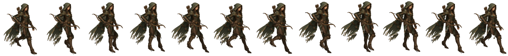

# BLUEPRINT — Kestrel (STASIUM XII, PC)

> **How to read this file.** Every number below is quoted from a file on the box (path given) or from Mauro's direct rules
> for this pack (marked **[Mauro rule]**). Anything not found is written as **MISSING / not yet made**. Values marked
> **[measured for this pack]** were read off the delivered PNGs by the pack builder (read-only), not from a doc.
> Times are ET. Built Sat Oct 3 2026. Nothing in the art folders was modified.

## 1. Identity

| item | value | source |
|---|---|---|
| who | **[Mauro rule]** Kestrel is a woman (METRICS.md also says "her right hand") | Mauro; `kestrel_march/proof_S_v6/METRICS.md` |
| role | Archer. Engine Marks 0–5. Default element Air. Role verb: Kestrel **marks**. | art guide §5 |
| body read | Long, light, bow breaks the outline | art guide §5 |
| shape language | **Long triangle, open negative space, feather, arc of a bow** | art guide §3 |
| colour family | Air / Kestrel: **chalk sky, pale gold, feather white. Not electric cyan.** | art guide §3 Color |
| palette hex (mobile-era file) | `palettes.json` "locked" Kestrel palette: primary_cloth **#554d32** (lo #35301e, hi #8c7238, "cloak/hood olive"); secondary_cloth **#3a3315** (lo #2a2410, hi #564b22, "tunic/pants darker green"); accent_wings **#c9ac68** (lo #7a5a38, hi #e5ca89, "gold wing language + trim"); leather **#47321a** (lo #392811, hi #533c25); skin **#e0b488**; weapon_wood **#72592d** | `/workspace/art/tools/gender_color/palettes.json` — written for the mobile/chibi art (`characters_custom` path contract) |
| palette hex of the locked march painting | **MISSING / not yet made** | — |
| Still socket | Guide rule: **one** socket, a small frozen-second relic (the guide's own example for Kestrel's token is "one frozen feather held in the air beside the bow", §9); same logic on every class, different material; not an implant. **Kestrel's socket material and placement on the locked art: MISSING / not yet made.** | art guide §5 step 5, §9 |
| kit (old mobile spec) | attack = Mark Shot; cast = Detonate | `/workspace/art/ANIMATION_FRAMES_SPEC.md` §2.1 |

## 2. How it's drawn

- **Style [Mauro rule]:** painted 2D in the Dofus / Waven / Wakfu family. **Never 3D.** The art guide adds: broken-hour painted
  fantasy, painted not neon, metal dull or beaten (not chrome), three to five values per character (guide §1, §3).
- **View [Mauro rule]:** a 3/4-turned painting with the **whole body and face turned to the walk direction as one unit** —
  never the head alone. The facing check recorded for this class's painting is listed under "Source painting" below.
- **Edges [Mauro rule]:** no cyan outline, no white dots, no halos, **hard alpha** (each pixel fully opaque or fully transparent).

- **Source painting (locked walk):** `/home/box/agent-data/agents/10888a55-2177-4c78-97bf-f62165f60d9b/attachments/73e0ae4f37d04e343c658ffa6ea2c57109e71df82d5d21a343fdfac27f92b62d.jpg` (= `/workspace/art/kestrel_march/proof_S_v6/work/paint.jpg`, 1280×720). METRICS: "Painting
  73e0ae4f (Kestrel repainted in Gloam's pose), H ≈ 670 painting px". **Facing check PASS:** "73e0ae4f passes (hood, face,
  chest, hips and both boots turned lower-right)". The earlier painting 9c8f8a35 FAILED (kept in `proof_S_v6/_prev_/facing_check_9c8f8a35_FAIL/`).
- Reference sheets: `/workspace/art/march_refs/kestrel_turnaround.jpg`, `/workspace/art/march_refs/kestrel_S_stand.png`.
- Edge audit (v6 METRICS): cyan 0, white dots 0/0/0/0, seam slivers 0, coloured outline px 0, 1 alpha component per frame.
  **Hard alpha: NOT MET** — the 12 delivered frames contain 40,801 semi-transparent pixels in total **[measured for this pack]**.
- Facing row in METRICS: **NOT MET** as measured ("det min 0.853" from the yaw squash on pelvis/torso; head and torso are never mirrored).
- Thumbnail in this pack: `ref/kestrel_source_painting_thumb_480.png`.

## 3. Facings

Locked facing rule (Mauro; also written in `/workspace/art/pc_team_characters_handoff/README.md` and
`/workspace/art/hero_anims_painted/*/NOTES.md`):

| letter | view | walk direction on screen | how it is made |
|---|---|---|---|
| **S** | front view | down-right | painted + rigged (locked march) |
| **W** | front view | down-left | mirror of S **[Mauro rule]** |
| **N** | back view | up-left | needs its own back-view source |
| **E** | back view | up-right | needs its own back-view source |

**Letter warning for coders.** Older docs and the mobile exports use the OLD letters: `ANIMATION_FRAMES_SPEC.md` v0.2,
`HANDOFF_SPRITES.md`, `export_2x/characters/*/anims/`, `grok_project/anims/BATCH1*.md` and `pc/characters_world/*/meta.json`
put E = front down-right, S = front down-left, N = back up-right, W = back up-left. The README's remap is:
old e → **S**, old s → **W**, old n → **E**, old w → **N**. So a mobile `*_e.png` is a locked-rule **S** view.

| Kestrel facing | exists? | path / note |
|---|---|---|
| **S** | **YES — locked, new** (12 frames) | `/workspace/art/kestrel_march/proof_S_v6/frames/kestrel_march_S_f00.png … f11.png` (copy: `/workspace/art/march_all/locked_S_walks/kestrel/`) |
| W | march version **MISSING / not yet made** (to be the mirror of S) | older preview: `/workspace/art/pc_team_characters_handoff/kestrel_walk_w.png` (8 frames, 1152×176, not locked) |
| N | march version **MISSING / not yet made** | older preview: `/workspace/art/pc_team_characters_handoff/kestrel_walk_n.png` (not locked) |
| E | march version **MISSING / not yet made** | older preview: `/workspace/art/pc_team_characters_handoff/kestrel_walk_e.png` (not locked) |

Open point for W: `ANIMATION_FRAMES_SPEC.md` §1.1 says "A mirror swaps the weapon hand", so a mirrored W puts the bow in her
left hand. No file resolves this for the march art.

## 4. Weapon rules

- **[Mauro rule] Bow in her right hand (image-left), at the hip, along the walk, never between the legs.**
- In v6 (METRICS build notes): the bow is cut as its own part; "It sits in her right hand (image-left), with the chord along the
  walk line (24.3 + 4.5·bounce → −2.3…+2.2°)". Bow-hand target: 60 px above the painted hand (hip-joint height), 10 px forward,
  40 px inward, slide amp 10 px. Bow vs boot / shin / visible thigh / between legs: **0 / 0 / 0 / 0 px every frame**. Bow over
  the tunic-hidden thigh tops: 205–303 px at 2× game (never visible). Bow hand slide −0.5…2.5 % H; "bow angle set by the bounce
  only, never swung".
- **All classes [Mauro rule]:** weapons ride the bounce with a **3–6° dip** and **never swing like a pendulum**. Kestrel v6 bow dip = **4.5°**, lowest at f2/f8 (METRICS, OK).
- **Stale-doc warning:** `ANIMATION_FRAMES_SPEC.md` §4.3 describes Kestrel as "he … bow in his LEFT hand", and the mobile
  strips follow that. The current rule is a woman with the bow in her right hand.

## 5. LOCKED walk blueprint

| item | value | source |
|---|---|---|
| locked version / folder | **v6** — `/workspace/art/kestrel_march/proof_S_v6/` | `march_all/locked_S_walks/MANIFEST.md` |
| frames / timing | **12 frames × 58.33 ms = 0.70 s** | METRICS.md; `march_all/locked_S_walks/MANIFEST.md` |
| frame size | **116 × 160 px**, RGBA | `march_all/locked_S_walks/MANIFEST.md`; METRICS.md "cell 116×160" |
| game scale / H | 0.214; H ≈ 670 painting px | METRICS.md |
| gait / root params | Gloam v8b `work/best.json` **unchanged** (same leg length L 141.96) | METRICS.md |
| files | `frames/`, `all_frames_f0_f11_4x.png`, `loop_4x_realtime.mp4`, `sbs_ref_vs_kestrel_v6.mp4`, `cmp3_v5_v6_gloam_v8b.mp4`, crops, `metrics.json` | folder listing |
| foot-contact anchor | **MISSING** ("not provided in metrics.json") | `march_all/locked_S_walks/MANIFEST.md` |

**Pipeline (METRICS build notes):** same code as Gloam v8b (`work/` = copies of its cut/rig/render/deliver scripts) → cut:
luminance/chroma figure mask plus cream feathers and skin, ground shadow excluded, quiver and arrows on the torso, long tunic
panel on the pelvis, bow as its own part, covered areas refilled by inpaint → rig (pelvis = single root; upper body on the
pelvis root in v6) → **full-res render (×4.67 supersample) → premultiplied area downscale** → cleanup: despeckle, light-fringe
clamp, detached scraps removed (<1 % of figure), seam-sliver clamp alternated with despeckle until both read 0.

**Class note [Mauro rule]: Kestrel v6 forward lean about 6°.** In the file: lean pelvis centre → hood centroid **4.2…7.3°, mean 6.0°** (OK).

**Key numbers (`proof_S_v6/METRICS.md`):**

| metric | Kestrel v6 | status in file |
|---|---|---|
| forward lean (pelvis → hood) | 4.2…7.3°, mean 6.0 | OK |
| chest pivot vs pelvis top | 0.00 px every frame | OK |
| spine bend toward weight side | ±2.6° at contact, peak ±3.0° one frame later | OK |
| shoulder counter-rotation | −7.1…+7.1° | OK |
| weight shift over the stance foot | peak 74 % (f2/f8); per frame 37 64 74 64 37 0 (×2) | OK |
| hood / cape lag | 1-frame lag + sway; hood−torso −2.3…+3.0°, cape−torso −2.0…+4.7°; neck/cape pin 0.000 px | OK |
| step heel-to-heel | 45.8 % H (302.3 px, same as Gloam v8b) | OK |
| ankle-to-ankle at contact f0 / f6 | 37.5 / 37.0 % | OK |
| hip drop | 3.62 % H | OK |
| highest / lowest frames | [3, 9] / [5, 11] | **NOT MET** |
| figure height f0–f5 | 94.2 95.6 96.3 96.3 95.6 94.2 % (range 94.2–98.5) | **NOT MET** (<97 %) |
| knees near f00–f11 | 13 14 17 16 23 34 54 75 69 51 34 32° | — |
| weight knee f1–f3 / contact / max | 14 17 16° / 13° / 75° | OK |
| max knee change | 20.6°/frame | OK |
| ankle pitch near | +13 +4 +0 +0 −1 −6 −10 −10 −8 −4 +1 +6° | OK |
| near thigh/shin fwd f06, f07 | +4/−50°, +39/−36° | see hook note below |
| swing gap min / knee in front of line min | 12.5 px / 16.0 px | OK |
| pelvis tilt / lateral shift | ±4.0° / peak 13.0 px of 17.5 px | OK |
| pelvis yaw / hip slide | ±15.0° / ±1.5 px | OK |
| waist gap | 0 every frame | OK |
| forward velocity | 9.76–11.80 gpx/f, mean 10.78 | OK |
| foot lift / slide / travel | 8.4 % H / 0.000 gpx / 129 gpx per cycle | — |

**Leg rules [Mauro rule]:** one weight leg and one swing leg. Weight knee soft, about 15°, with the hip dropped over it.
Swing knee lifts forward and the shin hangs. Heel lands first. The back foot pushes from the toe and leaves the ground — no
drag, no ballet point. Ankle: heel strike → flat → toe-off. Both soles flat only briefly at passing. Thigh and shin are two
shapes. The knee points with the foot; the feet point along the walk. No hook, no skim, flat whole-sole stance.

**Body rules [Mauro rule]:** the pelvis is the root. Chest, shoulders and hood ride the hip. The hip drops on the weight side.
The spine bends from the hip. The waist stays closed. The opposite shoulder counters ±7°. The body travels with the push.
Capes lag one frame.

Hook / skim test definitions (from `bastion_march/proof_S_v18c/METRICS.md`): *hook* = a swing frame with the shin behind −30°
from vertical, or the thigh not forward of vertical while the shin is behind; *skim* = swing toe clearance < 10 px (painting),
or both soles flat on more than one frame.

**Hook note (from the files):** `mender_march/proof_S_v9/METRICS.md`: "by the Bastion hook test, her locked swing has the shin
at −50° (f6) and −36° (f7)". Kestrel's own METRICS has no hook row. By the hook definition above, f6/f7 would count as hooks.

## 6. Attack, hit, death, cast, run

**Read first.** The only **locked** animation for any class is the S walk (section 5). Every action strip listed below was
built from the *older* painted walk keys (`mobile_walk_painted/`, round 3/4) or from mobile-era chibi art. None of them is
built from the locked march painting, and their cell sizes differ from the locked walk cell. Treat them as previews or stand-ins
unless their status line says "approved".

**Painted Kestrel attack / hit / death / cast: MISSING / not yet made.** The PC handoff README says "Kestrel attack/hit/death/cast — Not painted yet".

Older mobile-era strips that DO exist (old male design with the bow in the LEFT hand; limb puppet from the old chibi masters;
old letters; cell 144×160, pivot (72,152)); from `/workspace/art/grok_project/anims/BATCH1_HANDOFF.md` and `BATCH1C_SHIPPED.md`:

| state | real path(s) | frames | timing | Godot name (mobile `kestrel_frames.tres`) |
|---|---|---|---|---|
| attack (Mark Shot bow shot, Batch-1 v3) | `/workspace/art/export_2x/characters/kestrel/anims/kestrel_attack_{e,s,n,w}.png` (864×160); masters `/workspace/art/grok_project/anims/kestrel_attack_{se,sw,ne,nw}.png` | 6 | 12 fps, impact index 3 (release) | `attack_*` |
| cast (Detonate signal) | `…/kestrel/anims/kestrel_cast_{e,s,n,w}.png` | 6 | 10 fps, impact index 3 | `cast_*` |
| cast_mark (Mark Shot release) | `…/kestrel/anims/kestrel_cast_mark_{e,s,n,w}.png` | 6 | 12 fps, impact index 3 | `cast_mark_*` |
| hit | `…/kestrel/anims/kestrel_hit_{e,s,n,w}.png` (576×160) | 4 | 12 fps, impact index 0 | `hit_*` |
| death | `…/kestrel/anims/kestrel_death_{e,s,n,w}.png` | 6 | 10 fps, hold last, impact index 4 | `death_*` |
| walk (old, v3) | `…/kestrel/anims/kestrel_walk_{e,s,n,w}.png` | 6 | 12 fps loop | `walk_*` |
| **run** | `/workspace/art/pc/characters_world/kestrel/kestrel_run_{e,s,n,w}.png` (old letters; cell 144×160) | 8 | 16 fps, cycle 0.5 s; stride 124 px (e/w), 98.04 px (s/n) | — (PC world strips; mobile 0.1.61 static facings) |

Godot resource for the mobile set: `/workspace/sx_main/art/export_2x/characters/kestrel/kestrel_frames.tres`. PC SpriteFrames: **MISSING / not yet made**.
Palette variants of the old attack/walk exist under `/workspace/art/export_2x/characters_custom/kestrel/{default,alt}/{locked,storm,ember}/anims/`.

**Key poses** — old spec pose lists only (`ANIMATION_FRAMES_SPEC.md` §2.4, PROPOSED; written for the old left-hand bow):
attack (6, release on 4): ready → raise bow, nock → full draw → release → follow-through → recover. cast/Detonate (4 in spec,
6 shipped; signal on 3): ready → bow raised → right hand thrust forward, clenched → recover. hit: flinch, recoil, recover.
death: struck, knees buckle, both knees, topple, hits ground, lying still (compact, inside the cell).

## 7. Do / Don't checklist

Critique tests from the art guide (`/home/box/agent-data/agents/10888a55-2177-4c78-97bf-f62165f60d9b/attachments/2a57dc564a5110a3486aff0c72d6b2d87ebcc395e5c0401b77f21c62de1cbfb5.md` §2 loop steps 4–7, §11), plus Mauro's rules for this pack.

**Run these three tests on every new frame or strip:**
1. **Three-value test** (guide §2.4, §3 Value): block it in light / mid / dark before colour. Three values minimum, five maximum
   for a character. If the dark shape is not the character, redo it. If it turns to noise when you squint, it failed.
   Specular dots are not a value plan.
2. **Silhouette test** (guide §2.5): fill the figure black. You must be able to name the class from the blob alone.
   Shape language for this class: long triangle, open negative space, feather, arc of a bow.
3. **Board-scale test** (guide §2.6, §3 Scale): shrink it to its size on the 15×15 board (one body = one tile). If the class,
   tile or effect dies, it is not done. Props must not hide the tile under the feet.
4. Write a 5-line critique against guide §11 before calling it final.

**Do**
- Keep the bow in her right hand (image-left), at the hip, chord along the walk; keep it clear of the legs.
- Keep the whole body and face turned to the walk direction as one unit.
- Keep the weapon riding the bounce with a 3–6° dip, no pendulum.
- Keep hard alpha, zero cyan, zero white dots or halos (re-run the audits listed in section 5).
- Keep one colour family for the class; accent stays small (guide §3 Color).
- Keep the Still as one small frozen-second relic, not tech (guide §5 step 5).

**Don't** (guide §11 fails + §5 banned cues)
- Don't make it readable only as a poster; it must survive token size.
- Don't let it read as a desaturated cyberpunk frame, or as generic medieval mud.
- Don't draw the Still as tech, and don't invent a class, nation, Still, WP or a party above 4.
- Don't give all five classes the same cloak, boots and belt pouch.
- Don't let an effect hide the unit; don't draw VFX into character frames (ANIMATION_FRAMES_SPEC §1.4).
- Banned cues: guns, magazines, optical sights, earpiece comms, cyber eyes, hologram visor, power armour, neon piping,
  katana-as-default for Gloam, plate catalog knight for Bastion, bikini armour, mud-brown everyone.
- Don't put the bow between the legs or in the left hand; no gun, no optical sight, no neon string (guide §9, §12).
- Don't turn the head alone; don't build or render in 3D.

## 8. Contact strip of the locked walk

`ref/kestrel_locked_walk_S_contact_strip.png` — copied from `/workspace/art/march_all/locked_S_walks/kestrel/kestrel_contact_strip.png`
(1436×160, f00→f11).
