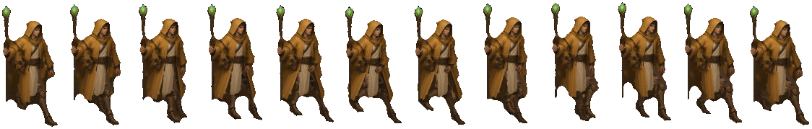

# BLUEPRINT — Mender (STASIUM XII, PC)

> **How to read this file.** Every number below is quoted from a file on the box (path given) or from Mauro's direct rules
> for this pack (marked **[Mauro rule]**). Anything not found is written as **MISSING / not yet made**. Values marked
> **[measured for this pack]** were read off the delivered PNGs by the pack builder (read-only), not from a doc.
> Times are ET. Built Sat Oct 3 2026. Nothing in the art folders was modified.

## 1. Identity

| item | value | source |
|---|---|---|
| role | Healer. Engine Pulse 0–6. Default element Water. Role verb: Mender **pulses**. | art guide §5 |
| body read | Soft vertical, cloth, open hands | art guide §5 |
| shape language | **Bowl, loop, soft vertical, cloth that holds water-light** | art guide §3 |
| what breaks the outline | "basin or staff" (guide); in the locked art, the vertical staff with the gem on top | guide §3; v9 METRICS |
| colour family | Water / Mender: **tide green, shell, linen. Not hospital teal.** | art guide §3 Color |
| palette hex | **MISSING / not yet made** (Mender is not in `palettes.json`). v9 METRICS only gives luminance values for the recoloured legs: trousers "median Y 58", shins/boots "Y 52/46, chroma of the painted boot 55/39/24" (quoted as written; not hex) | `mender_march/proof_S_v9/METRICS.md` |
| Still socket | Guide rule: **one** socket, a small frozen-second relic; same logic on every class, different material; not an implant. **Mender's socket material and placement: MISSING / not yet made.** | art guide §5 step 5 |
| hands | guide: hands show the verb — for Mender "cup"; open hands in the body read | art guide §5 |
| kit (old mobile spec) | **no weapon attack** ("the kit has no weapon attack"); cast = Mend, Pulse Tap, Ward, Cleanse, Heartstop | `/workspace/art/ANIMATION_FRAMES_SPEC.md` §2.1 |

## 2. How it's drawn

- **Style [Mauro rule]:** painted 2D in the Dofus / Waven / Wakfu family. **Never 3D.** The art guide adds: broken-hour painted
  fantasy, painted not neon, metal dull or beaten (not chrome), three to five values per character (guide §1, §3).
- **View [Mauro rule]:** a 3/4-turned painting with the **whole body and face turned to the walk direction as one unit** —
  never the head alone. The facing check recorded for this class's painting is listed under "Source painting" below.
- **Edges [Mauro rule]:** no cyan outline, no white dots, no halos, **hard alpha** (each pixel fully opaque or fully transparent).

- **Source painting (locked walk):** `/home/box/agent-data/agents/10888a55-2177-4c78-97bf-f62165f60d9b/attachments/699505cd7944732c3e9c1262554cb5c9acb334eb8d4bfcfe38100335756a4046.jpg` (= `/workspace/art/mender_march/proof_S_v9/work/paint.jpg`, 1280×720; "the approved turned
  painting (699505cd…)"). **Facing check** (STATUS 15:16, Mender v7): head/face, chest and hips face down-right — PASS; the
  image-left boot toe points at the camera (~63° off the walk line) — FAIL, so v7/v8 used the image-right boot for both feet.
  In v9 the legs and boots are Kestrel v6's, recoloured (see section 5). Crop: `/workspace/art/mender_march/proof_S_v7/facing_check_FAIL_boot.png`.
- Reference sheets: `/workspace/art/march_refs/mender_turnaround.jpg`, `/workspace/art/march_refs/mender_S_stand.png`.
- Edge audit (v9 METRICS): cyan 0, white dots 0, waist gap 0, seam slivers 0, strict light 0, 1 piece per frame,
  **hard alpha: semi px 0 (OK)** — confirmed 0 semi-transparent pixels in the 12 frames **[measured for this pack]**.
- Thumbnail in this pack: `ref/mender_source_painting_thumb_480.png`.

## 3. Facings

Locked facing rule (Mauro; also written in `/workspace/art/pc_team_characters_handoff/README.md` and
`/workspace/art/hero_anims_painted/*/NOTES.md`):

| letter | view | walk direction on screen | how it is made |
|---|---|---|---|
| **S** | front view | down-right | painted + rigged (locked march) |
| **W** | front view | down-left | mirror of S **[Mauro rule]** |
| **N** | back view | up-left | needs its own back-view source |
| **E** | back view | up-right | needs its own back-view source |

**Letter warning for coders.** Older docs and the mobile exports use the OLD letters: `ANIMATION_FRAMES_SPEC.md` v0.2,
`HANDOFF_SPRITES.md`, `export_2x/characters/*/anims/`, `grok_project/anims/BATCH1*.md` and `pc/characters_world/*/meta.json`
put E = front down-right, S = front down-left, N = back up-right, W = back up-left. The README's remap is:
old e → **S**, old s → **W**, old n → **E**, old w → **N**. So a mobile `*_e.png` is a locked-rule **S** view.

| Mender facing | exists? | path / note |
|---|---|---|
| **S** | **YES — locked, new** (12 frames) | `/workspace/art/mender_march/proof_S_v9/frames/mender_march_S_f00.png … f11.png` (copy: `/workspace/art/march_all/locked_S_walks/mender/`) |
| W | march version **MISSING / not yet made** (to be the mirror of S) | older preview: `/workspace/art/pc_team_characters_handoff/mender_walk_w.png` (8 frames, 1152×176, not locked) |
| N | march version **MISSING / not yet made** | older preview: `/workspace/art/pc_team_characters_handoff/mender_walk_n.png` (not locked) |
| E | march version **MISSING / not yet made** | older preview: `/workspace/art/pc_team_characters_handoff/mender_walk_e.png` (not locked) |

## 4. Weapon rules

- **[Mauro rule] Staff always vertical, gem on top, never touching the feet.**
- v9 METRICS: staff "vertical ±3°, gem on top, 0 overlap" → **0.0…0.0°**; staff-vs-legs overlap per frame
  [0, 0, 0, 0, 0, 0, 0, 0, 0, 0, 0, 0]; "staff hand moved out (arm 26°, v8 22°), grip 70 px lower as v8". v9 note: with Kestrel's
  longer stride "the staff then touched the back foot on f5 (2 gpx² at v8's arm angle), so the staff hand moves out a little more".
- v8 METRICS (upper body carried into v9): "hand on the pelvis root (bounce + weight shift only)", staff "rides bounce, never swings".
- **All classes [Mauro rule]:** weapons ride the bounce with a **3–6° dip** and **never swing like a pendulum**. For Mender the files record the staff tilt as 0.0° (kept vertical) and the bounce as vertical travel with the
  pelvis; a staff dip in degrees is **not recorded** for v9.
- Old-spec note: `ANIMATION_FRAMES_SPEC.md` describes "a tall wooden staff topped with a brass lantern glowing soft green-teal".
  The current rule is a staff with a gem on top.

## 5. LOCKED walk blueprint

| item | value | source |
|---|---|---|
| locked version / folder | **v9** — `/workspace/art/mender_march/proof_S_v9/` | `march_all/locked_S_walks/MANIFEST.md` |
| frames / timing | **12 frames × 58.33 ms = 0.70 s** | METRICS.md ("12 frames × 58.33 ms"); MANIFEST.md |
| frame size | **90 × 179 px**, RGBA | `march_all/locked_S_walks/MANIFEST.md`; METRICS.md "cell 90×179" |
| game scale | 0.214 | METRICS.md |
| files | `frames/`, `mender_march_S_strip_f0_f11.png`, `all_frames_f0_f11_4x.png`, `loop_4x_realtime.mp4`, `sbs_ref_vs_mender_v9.mp4`, `cmp3_mender_v8_v9_kestrel_v6_x2.mp4` (+ f05/f08 PNGs), legs crops, `metrics.json` | folder listing |
| foot-contact anchor | **MISSING** (MANIFEST: "not provided in metrics.json") | `march_all/locked_S_walks/MANIFEST.md` |

**Class note [Mauro rule]: Mender v9 = Kestrel v6's legs recoloured brown under the painted-length coat.** In the file: "v9 drops
the v8 painted legs entirely. The legs are Kestrel v6's locked legs and motion, unchanged except for the ×0.99 uniform scale and
the brown recolour. Mender's upper body, coat (painted length, hem cleaned as in v8), hood, staff and facing are v8."
Legs source: `kestrel_march/proof_S_v6/work` (read-only dump: `work/kestrel_legs.json`, `kestrel_leg_parts.pkl`).

**Pipeline:** upper body / coat / hood / staff parts cut from the 699505cd painting (v5–v8: "Ironjaw v5 method, robe split into
centre/left/right panels, staff separate"; v7 "upgrading the Mender v6 rig with the Bastion v18c method (FK swing, pelvis root,
hard-alpha clean pass)") + Kestrel v6 leg parts → rig driven by Kestrel's hip motion (torso locked to the pelvis, coat panels one
frame behind the thighs) → full-res render → area downscale → clean pass (cyan / dots / waist gap / slivers / scraps / strict
light / hard alpha all 0). Scripts: `work/deliver9.py`, `work/kx.py`, `work/mk_md9.py`.

**Key numbers (`proof_S_v9/METRICS.md`):**

| metric | Mender v9 | status in file |
|---|---|---|
| scale | ×0.99 uniform (hip height 335/350 = 0.957, hip width 123/120 = 1.025, geometric mean) | OK |
| stride / slide | S 299.2 px (Kestrel 302.3 × 0.99), equal steps; planted-ankle drift 0.00 gpx | OK |
| weight knee f2 / f3 | 16.8 / 15.8° | OK (≈15°) |
| pelvis root | Kestrel's root ×0.99 (bounce + surge + lateral 13.0 px + tilt ±4.0°); torso-vs-pelvis 0.0 px | OK |
| lean | 4.5…7.5° | OK |
| coat panels | follow their own thighs, 1 frame late: robe_m −13.0…14.0°, robe_s −13.2…14.0° | OK |
| near leg f00–f11 knee° | 12.9 14.0 16.8 15.8 23.1 33.9 54.4 74.9 68.6 50.7 34.4 32.4 | (legs table) |
| near thigh° / shin° f06, f07 | 4.4 / −50.0, 38.8 / −36.1 | see hook note |
| on-screen horizontal ankle gap f00–f11 | 191.8 59.6 51.4 141.8 206.3 241.2 198.6 65.2 47.1 136.9 200.6 235.4 px | — |
| stride in % H, hip drop %, highest/lowest frames, figure height %, shoulder counter-rotation | **not stated in v9 METRICS — MISSING** (v8, with its own legs, measured shoulder counter ±7.0° and lean 4.5…7.5°; the hip motion is Kestrel v6's — see BLUEPRINT_Kestrel.md) | — |

**Leg rules [Mauro rule]:** one weight leg and one swing leg. Weight knee soft, about 15°, with the hip dropped over it.
Swing knee lifts forward and the shin hangs. Heel lands first. The back foot pushes from the toe and leaves the ground — no
drag, no ballet point. Ankle: heel strike → flat → toe-off. Both soles flat only briefly at passing. Thigh and shin are two
shapes. The knee points with the foot; the feet point along the walk. No hook, no skim, flat whole-sole stance.

**Body rules [Mauro rule]:** the pelvis is the root. Chest, shoulders and hood ride the hip. The hip drops on the weight side.
The spine bends from the hip. The waist stays closed. The opposite shoulder counters ±7°. The body travels with the push.
Capes lag one frame.

Hook / skim test definitions (from `bastion_march/proof_S_v18c/METRICS.md`): *hook* = a swing frame with the shin behind −30°
from vertical, or the thigh not forward of vertical while the shin is behind; *skim* = swing toe clearance < 10 px (painting),
or both soles flat on more than one frame.

**Hook note (from the file):** "by the Bastion hook test, her locked swing has the shin at −50° (f6) and −36° (f7). That is
Kestrel v6's own approved motion, carried over unchanged as instructed, not a v9 change."

## 6. Attack, hit, death, cast, run

**Read first.** The only **locked** animation for any class is the S walk (section 5). Every action strip listed below was
built from the *older* painted walk keys (`mobile_walk_painted/`, round 3/4) or from mobile-era chibi art. None of them is
built from the locked march painting, and their cell sizes differ from the locked walk cell. Treat them as previews or stand-ins
unless their status line says "approved".

| state | real path(s) | frames | timing | status |
|---|---|---|---|---|
| **attack** | — | — | — | **none by design**: "the kit has no weapon attack" (`ANIMATION_FRAMES_SPEC.md` §2.1; §2.3 lists Mender attack "—") |
| **cast** | — | — | — | **MISSING / not yet made** — handoff README: "Mender attack/hit/death/cast — Not painted yet". Old spec PROPOSED: lantern cast, 5 frames, 10 fps, 0.55 s, release on frame 4, frame 3 held ×1.5 |
| **hit** | painted: **MISSING / not yet made**. Old mobile chibi strip only: `/workspace/scratch/repo/art/export_2x/characters/mender/anims/mender_hit_{e,s,n,w}.png` (576×160) | 4 (old strip) | **not documented** for that strip (spec: 3 frames @ 12 fps, 0.25 s) | old art, not painted, old letters |
| **death** | — | — | — | **MISSING / not yet made** (spec PROPOSED: 6 frames @ 10 fps, 0.60 s, ground on frame 5) |
| **run** | `/workspace/art/pc/characters_world/mender/mender_run_{e,s,n,w}.png` (old letters; cell 144×160) | 8 | 15 fps, cycle 0.5333 s; stride 100 px (e/w), 79.07 px (s/n); `meta.json`: "staff is planted-ish (held near vertical" | built from mobile 0.1.61 static facings; not locked |

**Key poses** — old spec only (`ANIMATION_FRAMES_SPEC.md` §2.4, PROPOSED, written for the lantern staff): cast 1 ready, staff
planted beside her in the right hand; 2 lifting the staff, left hand opening; 3 staff raised high above the head; 4 release —
staff thrust forward, left palm pushed forward; 5 recover. hit: flinch, recoil, recover. death: struck … lying still (compact).

**Godot animation names:** spec pattern `cast_<e|s|n|w>`, `hit_*`, `death_*`, `walk_*` (old letters, §8). No Mender SpriteFrames
`.tres` found (the mobile ship log says "Mender and Bastion load from the PNGs"). PC SpriteFrames: **MISSING / not yet made**.

## 7. Do / Don't checklist

Critique tests from the art guide (`/home/box/agent-data/agents/10888a55-2177-4c78-97bf-f62165f60d9b/attachments/2a57dc564a5110a3486aff0c72d6b2d87ebcc395e5c0401b77f21c62de1cbfb5.md` §2 loop steps 4–7, §11), plus Mauro's rules for this pack.

**Run these three tests on every new frame or strip:**
1. **Three-value test** (guide §2.4, §3 Value): block it in light / mid / dark before colour. Three values minimum, five maximum
   for a character. If the dark shape is not the character, redo it. If it turns to noise when you squint, it failed.
   Specular dots are not a value plan.
2. **Silhouette test** (guide §2.5): fill the figure black. You must be able to name the class from the blob alone.
   Shape language for this class: bowl, loop, soft vertical, cloth that holds water-light.
3. **Board-scale test** (guide §2.6, §3 Scale): shrink it to its size on the 15×15 board (one body = one tile). If the class,
   tile or effect dies, it is not done. Props must not hide the tile under the feet.
4. Write a 5-line critique against guide §11 before calling it final.

**Do**
- Keep the staff vertical with the gem on top and clear of both feet on every frame; keep the coat at its painted length with the panels following the thighs one frame late.
- Keep the whole body and face turned to the walk direction as one unit.
- Keep the weapon riding the bounce with a 3–6° dip, no pendulum.
- Keep hard alpha, zero cyan, zero white dots or halos (re-run the audits listed in section 5).
- Keep one colour family for the class; accent stays small (guide §3 Color).
- Keep the Still as one small frozen-second relic, not tech (guide §5 step 5).

**Don't** (guide §11 fails + §5 banned cues)
- Don't make it readable only as a poster; it must survive token size.
- Don't let it read as a desaturated cyberpunk frame, or as generic medieval mud.
- Don't draw the Still as tech, and don't invent a class, nation, Still, WP or a party above 4.
- Don't give all five classes the same cloak, boots and belt pouch.
- Don't let an effect hide the unit; don't draw VFX into character frames (ANIMATION_FRAMES_SPEC §1.4).
- Banned cues: guns, magazines, optical sights, earpiece comms, cyber eyes, hologram visor, power armour, neon piping,
  katana-as-default for Gloam, plate catalog knight for Bastion, bikini armour, mud-brown everyone.
- Don't let the staff tilt, swing or touch a foot; don't use hospital teal; don't hide every hand in a fist.
- Don't turn the head alone; don't build or render in 3D.

## 8. Contact strip of the locked walk

`ref/mender_locked_walk_S_contact_strip.png` — copied from `/workspace/art/march_all/locked_S_walks/mender/mender_contact_strip.png`
(1124×179, f00→f11).
